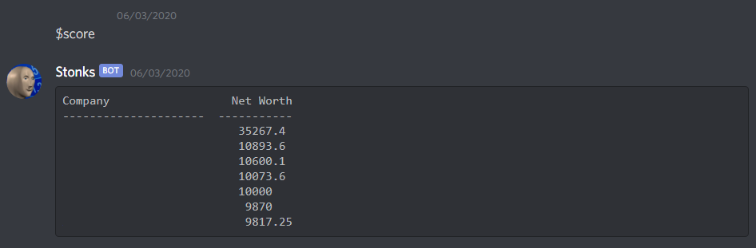
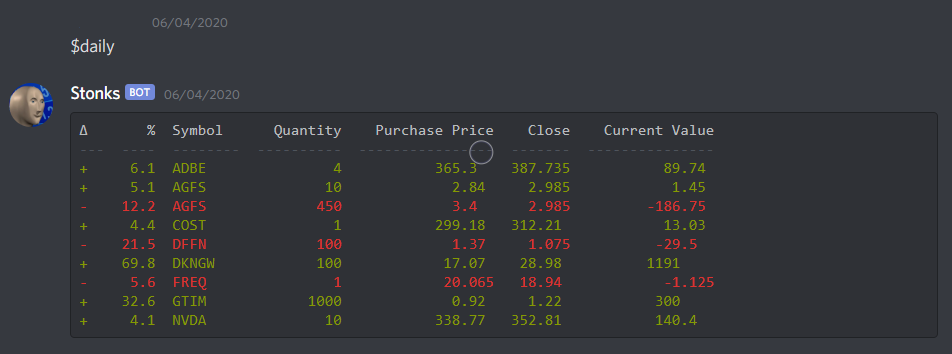
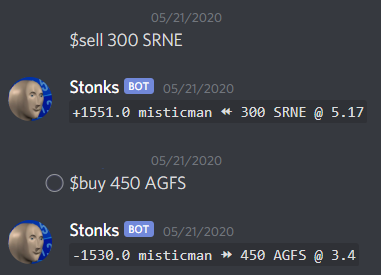

# Stonks

**Stonks** is a small chat-based game built as a challenge project during the SARS-COV-2 lockdown. 

It is designed to be a simplified (and consequentially inaccurate) simulator of the US stock market. 

This bot was built with discord-py and the iexfinance API. 

## Features:
- Realtime US stock market data from IEX.
- Database implemented with SQLAlchemy.
- Sane API polling functions to minimise number of requests. 
- Player leaderboards.
- Automatic dividend payouts. 

## Dependencies:

- discord-py 
- iexfinance
- numpy 
- pandas
- sqlalchemy
- tabulate

## How to run:

This bot is self hosted. Before you start the bot, make sure to run `initialise.py`. 

## Screenshots:

### Player Leaderboards:

### Portfolios:

### Live trading:
